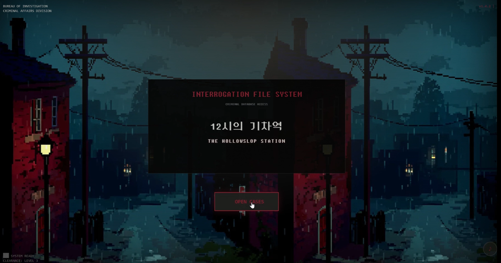
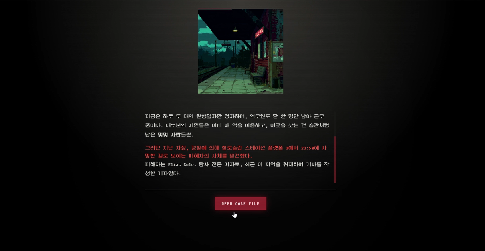
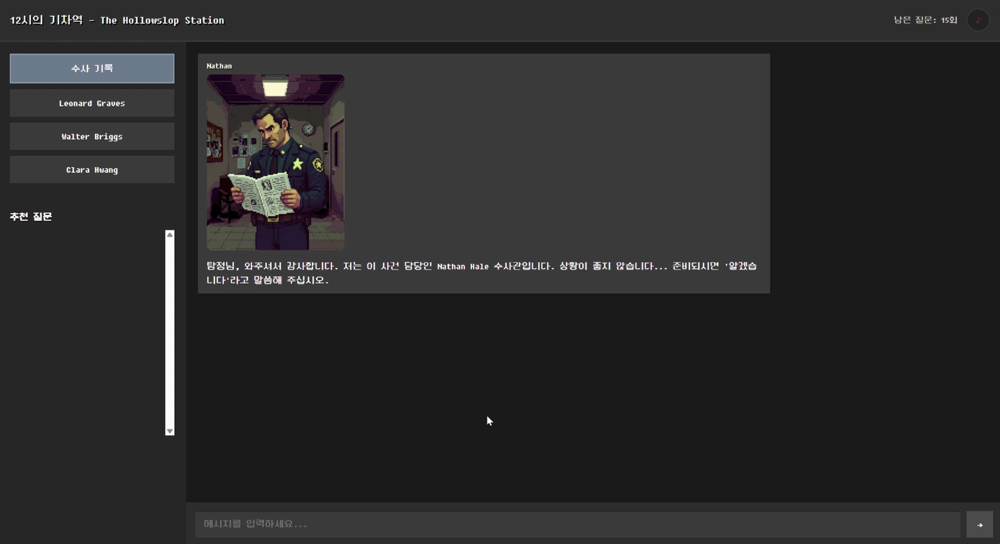
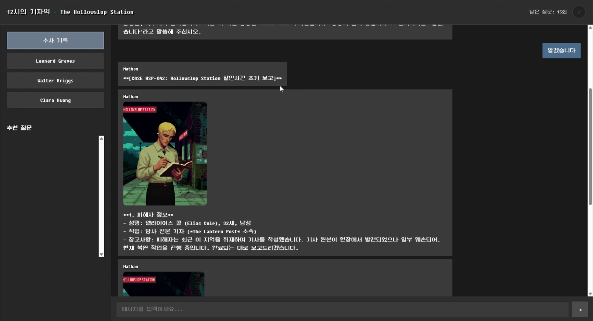
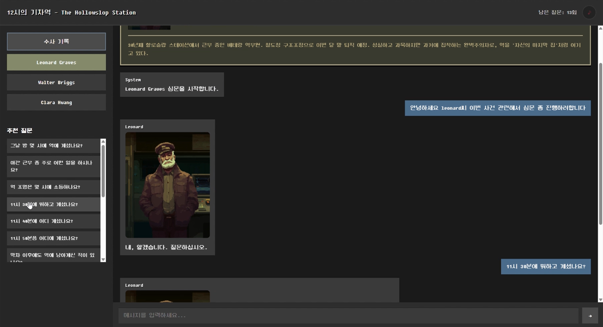
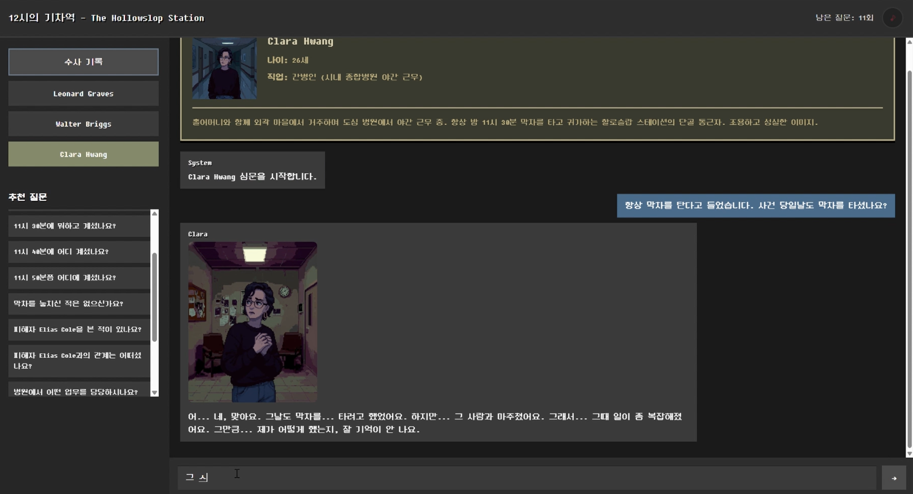
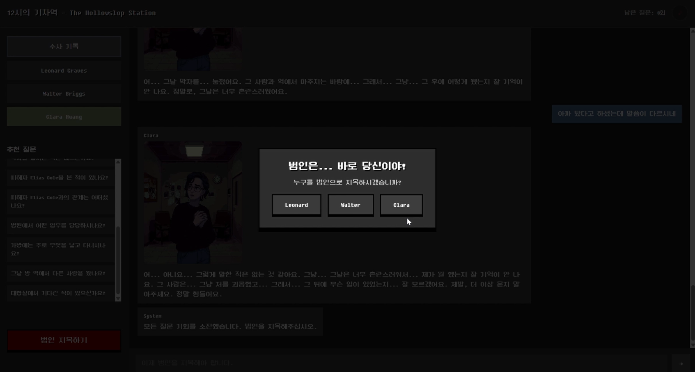
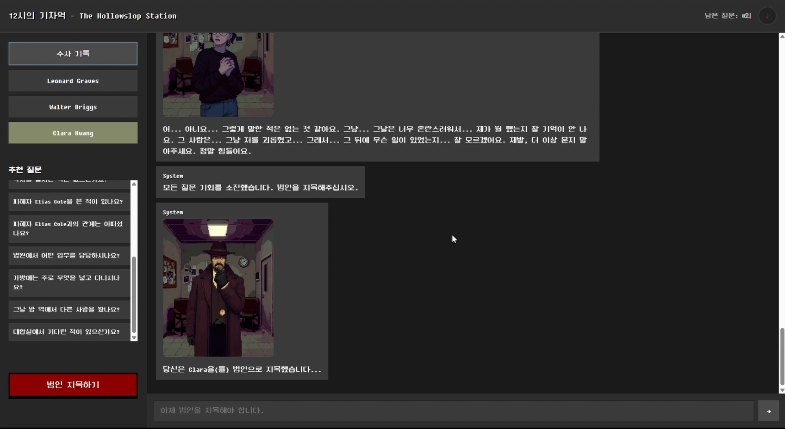
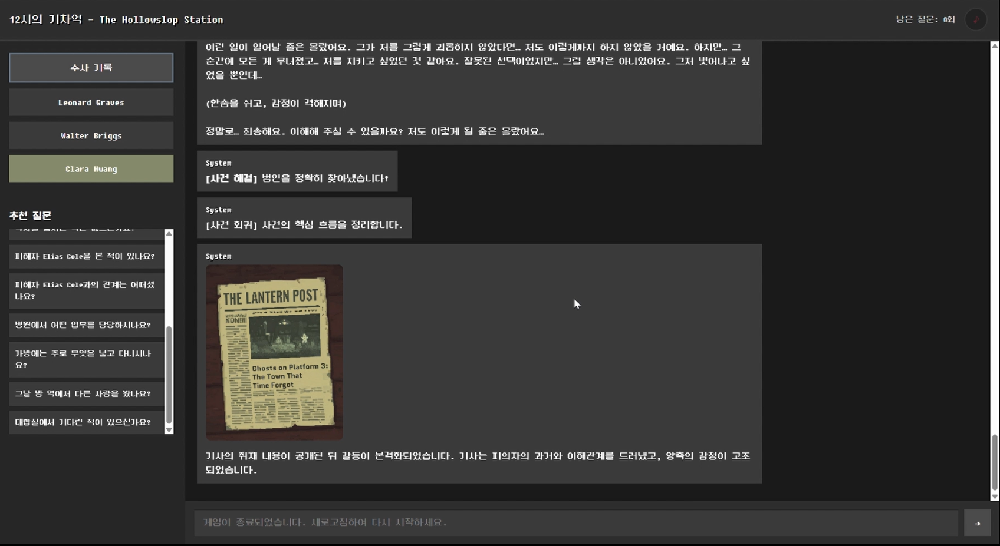
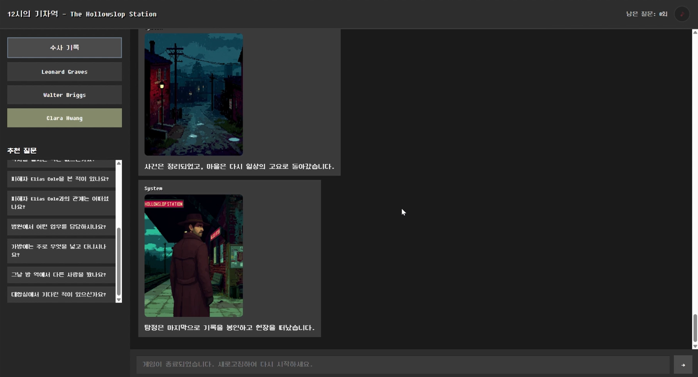

# HateSlop 3기 엔지니어x프로듀서 합동 캐릭터 챗봇 프로젝트

## 🎯 프로젝트 개요

- 📖 학습 목표: RAG, Embedding, LLM, Vector Database
- 👥 협업 방식: 프로듀서가 기획한 내용을 바탕으로 캐릭터 챗봇을 완성
- 🐳 환경: Docker로 일관된 개발 환경 보장

### 핵심 기능

- 🤖 OpenAI GPT 기반 대화 생성
- 📚 RAG (Retrieval-Augmented Generation)를 통한 지식 기반 답변
- 💾 ChromaDB를 활용한 임베딩 벡터 저장
- 🧠 LangChain 기반 대화 메모리 관리
- 🎨 Vanilla JavaScript 기반 웹 인터페이스
- 🐳 Docker를 통한 환경 일관성 보장

### 기술 스택

- Backend: Flask (Python 3.11)
- AI: OpenAI API, LangChain, ChromaDB
- Frontend: Vanilla JavaScript, HTML, CSS
- Infrastructure: Docker
- Version Control: Git, GitHub

---

# 🕵️ 3-Character Detective Chatbot  
**The Hollowslop Station**

AI 기반 인터랙티브 추리 게임.  
플레이어는 탐정이 되어 3명의 용의자를 심문하며 **15번의 질문 안에 범인을 찾아내는** 웹 기반 추리 챗봇입니다.

---

# 🖼 작동 화면

### 🎬 1. 인트로 화면
플레이어가 탐정으로서 사건에 진입하기 전 보여주는 시작 페이지

<p align="center">   </p>

### 📝 2. 시작 브리핑 화면 (경찰 초기 보고)
피해자 정보, 사건 개요, 장소 등의 첫 브리핑을 제공하는 화면

<p align="center">   </p>

### 💬 3. 심문 화면 (용의자 대화)
용의자 3명의 탭을 이동하며 자유 질문을 입력하는 메인 추리 단계

<p align="center">   </p>

### 🎯 4. 범인 지목 화면
질문이 5개 이하로 남으면 활성화되어, 최종적으로 범인을 특정하는 화면

<p align="center">   </p>

### 🔔 5. 결말 화면 (엔딩)
범인을 맞췄는지 여부에 따라 엔딩 이미지와 결론 메시지가 달라지는 결과 페이지

<p align="center">   </p>

---

# 📁 프로젝트 구조

```
3-character-chat/
├── app.py
├── docker-compose.yml
├── Dockerfile
├── requirements.txt
├── ADVANCED_TOPICS.md
├── ARCHITECTURE.md
├── DOCKER-GUIDE.md
├── RENDER-GUIDE.md
│
├── config/
│   ├── chatbot_config.json
│   ├── clara_hwang.json
│   ├── leonard_graves.json
│   └── walter_briggs.json
│
├── services/
│   ├── chatbot_service.py        # 핵심 AI 대화 흐름 처리
│   └── __init__.py
│
├── static/
│   ├── css/style.css
│   ├── js/chatbot.js             # 프론트 대화 로직
│   ├── mp3/                      # BGM 파일
│   ├── images/                   # 캐릭터, 배경, 단서 등
│   │   ├── adrian_vale/
│   │   ├── background/
│   │   ├── clara_hwang/
│   │   ├── elias_cole/
│   │   ├── evidence/
│   │   ├── leonard_graves/
│   │   ├── walter_bridges/
│   │   └── outro/
│   │
│   └── data/chatbot/
│       ├── case_files/
│       │   ├── case_brief.md
│       │   └── nathan_hale_script.json
│       │
│       ├── chardb_embedding/     # ChromaDB 저장 파일
│       └── chardb_text/          # 용의자별 knowledge.json
│           ├── clara_hwang/
│           ├── leonard_graves/
│           └── walter_briggs/
│
└── templates/
    ├── index.html                # 인트로
    ├── detail.html               # 브리핑/설명 화면
    └── chat.html                 # 메인 심문 화면

```

---

# 🧠 시스템 구조 (The Hollowslop Station)

```

[사용자 입력]
    │
    ▼
chatbot.js (fetch → /api/chat)
    │
    ▼
Flask(app.py)
    │
    ▼
chatbot_service.py
 1) 현재 용의자 선택 상태 확인
 2) 질문 횟수/게임 흐름 업데이트
 3) (설계 기반) 임베딩 → ChromaDB 검색
 4) knowledge.json에서 알리바이/거짓 패턴 로드
 5) 프롬프트 구성 (페르소나 + 상황)
 6) OpenAI API 응답 생성
 7) 이미지를 포함한 JSON 프론트로 반환
    │
    ▼
프론트 UI 렌더링
- 대화 추가
- 질문 카운트 감소
- 7회차 중간보고 표시
- 5회차 이하 → 지목 버튼 활성화

```

### 📑 Slide 1: 타이틀 + 개요

```
━━━━━━━━━━━━━━━━━━━━━━━━━━━━━━━━

    AI 기반 추리 게임 챗봇
    "The Hollowslop Station"

━━━━━━━━━━━━━━━━━━━━━━━━━━━━━━━━

📌 핵심 기술
• RAG (Retrieval-Augmented Generation)
• 하이브리드 검색 (벡터 70% + 키워드 30%)
• 동적 지식 활성화 (범인 랜덤 선택)
• 프롬프트 엔지니어링
```

---

### 🗂️ Slide 2: 데이터 구성 - 전체 아키텍처

```
┌─────────────────────────────────────────────────┐
│  용의자별 knowledge.json (정적 데이터)            │
├─────────────────────────────────────────────────┤
│ {                                               │
│   "core_facts": [                               │
│     {                                           │
│       "keywords": ["Elias Cole", "피해자"],      │
│       "fact_innocent": "취재차 봤습니다",         │
│       "fact_killer": "여러 번 인터뷰했죠",        │
│       "lie_behavior": "회피적으로 답하라"         │
│     }                                            │
│   ],                                             │
│   "recommended_questions": [...],                │
│   "killer_confession_details": {...}             │
│ }                                                │
└─────────────────────────────────────────────────┘
                    ↓ 게임 시작 시
┌─────────────────────────────────────────────────┐
│  ChromaDB (벡터 DB - 동적 생성)                  │
├─────────────────────────────────────────────────┤
│ • Collection: "suspect_leonard/walter/clara"     │
│ • Embedding: text-embedding-3-small (3072차원)   │
│ • Metadata: keywords + lie_behavior + image      │
└─────────────────────────────────────────────────┘

범인 = random.choice(['leonard', 'walter', 'clara'])
         → 같은 질문, 다른 진실 제공
```

---

### 🎮 Slide 3: 게이미피케이션 6가지 메커니즘

```
┌─────────────────────────────────────────────┐
│ 1️⃣ 제한된 질문 (15회) → 긴장감              │
│ 2️⃣ 3명 용의자 탭 전환 → 개별 대화 로그      │
│ 3️⃣ Nathan Hale 보조 캐릭터 → 초기 브리핑    │
└─────────────────────────────────────────────┘
┌─────────────────────────────────────────────┐
│ 4️⃣ 중간 단서 제공 (7번 질문 후)              │
│    → 범인별 맞춤 증거 자동 제공               │
│                                             │
│    ┌─ Leonard 범인 → 조작된 티켓              │
│    ├─ Walter 범인  → 기름 묻은 발자국         │
│    └─ Clara 범인   → 지문이 남지 않은 가위     │
└─────────────────────────────────────────────┘
┌─────────────────────────────────────────────┐
│ 5️⃣ 감정 분석 시스템                         │
│    GPT → "분노/긴장/슬픔/불안" → 표정 변화   │
│                                              │
│ 6️⃣ 추천 질문 시스템                         │
│    "11시 30분에 뭐하고 계셨나요?"            │
│    "피해자 Elias Cole과의 관계는?"           │
└─────────────────────────────────────────────┘

🎯 효과: 막막할 때 힌트 제공 → 이탈 방지
```

---

### 🤖 Slide 4: 챗봇 응답 생성 파이프라인

```
[1] 사용자 질문 "Elias Cole을 본 적 있나요?"
          ↓
[2] 쿼리 임베딩 → [0.23, -0.45, ..., 0.89] (3072차원)
          ↓
[3] 하이브리드 RAG 검색 ⭐
    ├─ ChromaDB 벡터 검색: Top-3 후보
    └─ 키워드 매칭 재순위

    예시:
    후보1: "공구 제자리..."
           vector:0.80, keyword:0.0 → hybrid:0.56
    후보2: "Elias Cole 인터뷰..." ✅
           vector:0.77, keyword:1.0 → hybrid:0.84
          ↓
[4] 프롬프트 구성
    • 페르소나 + 검색된 사실(fact)
    • 거짓말 지침(lie_behavior, 범인만)
    • 대화 히스토리 (최근 4턴)
          ↓
[5] GPT-4o-mini 생성 → 감정 분석 → 이미지 선택
          ↓
[6] 최종 응답 { reply, image, sender }
```

---

### 🎭 Slide 5: 프롬프트 엔지니어링

**핵심**: "속마음"으로 제공 → AI가 자연스럽게 연기 유도

**나쁜 예:**
```
"거짓말하라. Elias Cole을 봤다고 하지 말라"
→ AI가 부자연스럽게 거부
```

**좋은 예:**
```
"너는 범인이다. 속마음: 'Elias Cole을 봤다는 걸 들키면 안 돼. 
하지만 완전히 부인하면 오히려 의심받을 수 있어.'
→ 회피적으로 답하라"
→ AI가 자연스럽게 연기
```

**효과:**
- 범인: 회피적, 긴장한 답변 생성
- 무죄: 자연스럽고 일관된 답변
- 사용자가 범인을 추론할 수 있는 단서 제공

---

### 🔧 Slide 6: 트러블슈팅 1 - 키워드 → RAG

```
❌ 문제: 키워드 매칭의 한계

┌──────────────────────────────────────────┐
│ 초기 구현                                 │
├──────────────────────────────────────────┤
│ if any(kw in query for kw in keywords): │
│     return item['fact']                  │
└──────────────────────────────────────────┘

🔴 실패 사례:
• "11시 반" ≠ "11시 30분" → 매칭 실패
• "Elias Cole 봤나요?" → "공구" 답변 (오매칭)
• Full text prompting → 결과가 나쁘진 않으나 과제 필수구현에 안맞음

━━━━━━━━━━━━━━━━━━━━━━━━━━━━━━━━━━━━

✅ 해결: RAG 도입

┌──────────────────────────────────────────┐
│ OpenAI Embedding API                     │
├──────────────────────────────────────────┤
│ text-embedding-3-small (3072차원)        │
│ ChromaDB 코사인 유사도 검색              │
└──────────────────────────────────────────┘

✅ 효과:
• "11시 반" == "11시 30분" (유사도: 0.92)
• 토큰 사용량 80% 감소 ⬇
```

---

### 🔧 Slide 7: 트러블슈팅 2 - 데이터 부족

```
❌ 문제: 범인 데이터 부족

┌─────────────────────────────────────────┐
│ 근본적 딜레마                            │
├─────────────────────────────────────────┤
│ 1. 범인이 자연스럽게 거짓말하려면        │
│ 2. 모든 예상 질문의 "거짓말 대본" 필요   │
│ 3. 예상 질문 100개 × 3명 = 300개        │
│ 4. 단기간 작성 불가능 ⚠                 │
└─────────────────────────────────────────┘

🔴 실제 문제:
사용자: "어제 저녁 뭐 드셨어요?" (예상 외 질문)
봇: "그런 질문은 답할 수 없습니다" (부자연스러움)

━━━━━━━━━━━━━━━━━━━━━━━━━━━━━━━━━━━━

✅ 해결: 추천 질문 + Nathan 중간 보고

┌─────────────────────────────────────────┐
│ 1. 추천 질문으로 핵심 질문 유도          │
│    → 준비된 데이터 활용률 ↑             │
│                                          │
│ 2. Nathan이 7번 질문 후 힌트 제공        │
│    → "탐정님, 새로운 증거 발견!"         │
│    → 범인별 맞춤 증거 자동 제시          │
└─────────────────────────────────────────┘

✅ 효과: 이탈률 감소 + 게임 진행 원활
```

---

### 🚀 Slide 8: 발전 방향

```
💡 개선안: 선택지 기반 시스템

현재: AI가 모든 답변 생성 → 데이터 구성 부담 ↑
      ↓
개선: 선택지 기반 심문

┌──────────────────────────────────────────┐
│ 탐정: "11시 30분에 어디 계셨나요?"        │
├──────────────────────────────────────────┤
│ [A] 증거 제시: "이 사진은 당신 아닌가요?" │
│ [B] 압박: "거짓말하는 것 같은데요"        │
│ [C] 다음 질문으로 넘어가기                │
└──────────────────────────────────────────┘
         ↓
    AI는 선택지에 맞는 "반응"만 생성
    → 프롬프팅만으로 충분 (RAG 불필요)

✅ 장점:
• 데이터 부담 ↓
• 스토리 통제 ↑
• 사용자 부담 ↓ (자유 입력 → 선택)
```

---

### 🎯 Slide 9: 성과 & 결론

```
1️⃣ RAG는 만능이 아니다
   → RAG는 도구일 뿐, 게임 경험이 우선

2️⃣ AI < Gamification
   → 게이미피케이션 메커니즘이 핵심
   → AI는 이를 지원하는 도구

3️⃣ 사용자 경험이 우선이다
   → 성능 최적화 (백그라운드 프리워밍)
   → 자연스러운 대화 (프롬프트 엔지니어링)
   → 점진적 개선의 중요성
```
